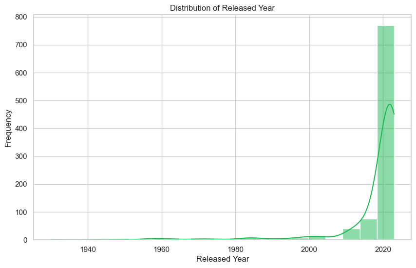
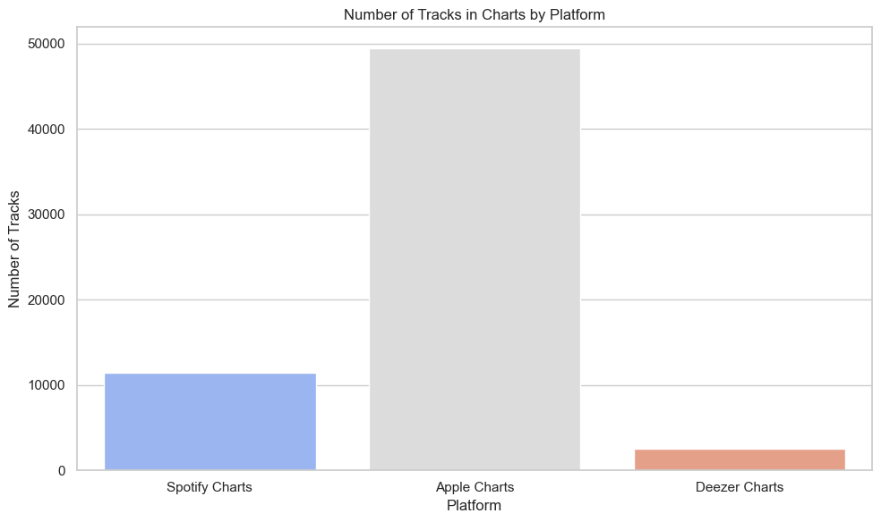
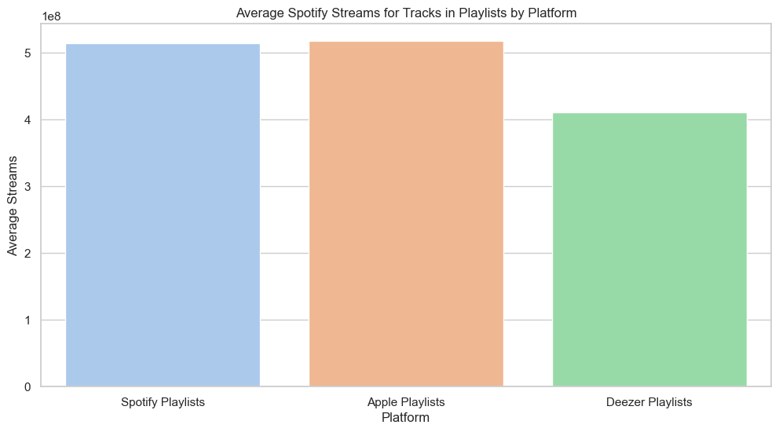
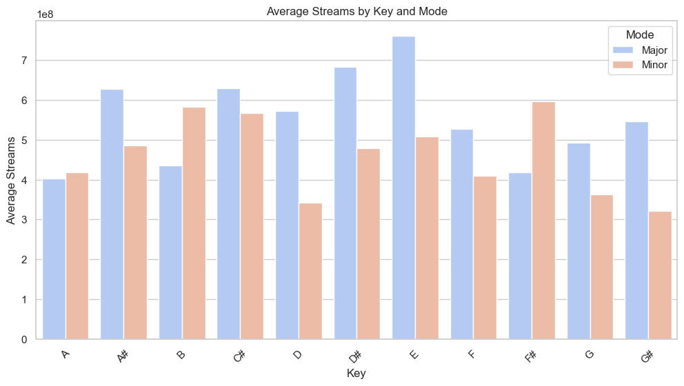

# Exploratory Data Analysis: Most Streamed Spotify Songs 2023


## Table of Contents
- [Introduction](#introduction)
- [Dataset Preparation](#most-streamed-spotify-songs-2023)
- [1. Overview of Dataset](#1-overview-of-dataset)
- [2. Basic Descriptive Statistics](#2-basic-descriptive-statistics)
- [3. Top Performers](#3-top-performers)
- [4. Temporal Trends](#4-temporal-trends)
- [5. Genre and Music Characteristics](#5--genre-and-music-characteristics)
- [6. Platform Popularity](#6--platform-popularity)
- [7. Advanced Analysis](#7--advanced-analysis)
- [Key Observation: Keys n Modes](#key-observations)
- [Key Observation: Artist Dominance n Musical Style](#key-observations-1)

## Introduction
This project performs an exploratory data analysis (EDA) on the dataset of the Most Streamed Spotify Songs in 2023. The aim is to analyze, visualize, and interpret data to extract meaningful insights. Dataset link: [Kaggle Dataset](https://www.kaggle.com/datasets/nelgiriyewithana/top-spotify-songs-2023).

You can also open my Jupyter notebook file that I’ve uploaded [here](https://github.com/acx-six/Assignment-1/blob/main/Untitled-1.ipynb).

# **Most Streamed Spotify Songs 2023**

**Import libraries and load the dataset**  
**Get the stats for each column**


```python
# Importing required libraries
import pandas as pd
import numpy as np
import matplotlib.pyplot as plt
import seaborn as sns
import warnings
warnings.simplefilter(action='ignore', category=FutureWarning)
warnings.simplefilter(action='ignore', category=pd.errors.SettingWithCopyWarning)


# Load the dataset (ensure the path is correct if it's local)
spotify_data = pd.read_csv('C:/Users/ACDC/Desktop/archive/spotify-2023.csv', encoding='latin-1')


# Checking the structure of the dataset
# print(spotify_data.info())
spotify_data.describe()
```


<div>

<table border="1" class="dataframe">
  <thead>
    <tr style="text-align: right;">
      <th></th>
      <th>artist_count</th>
      <th>released_year</th>
      <th>released_month</th>
      <th>released_day</th>
      <th>in_spotify_playlists</th>
      <th>in_spotify_charts</th>
      <th>in_apple_playlists</th>
      <th>in_apple_charts</th>
      <th>in_deezer_charts</th>
      <th>bpm</th>
      <th>danceability_%</th>
      <th>valence_%</th>
      <th>energy_%</th>
      <th>acousticness_%</th>
      <th>instrumentalness_%</th>
      <th>liveness_%</th>
      <th>speechiness_%</th>
    </tr>
  </thead>
  <tbody>
    <tr>
      <th>count</th>
      <td>953.000000</td>
      <td>953.000000</td>
      <td>953.000000</td>
      <td>953.000000</td>
      <td>953.000000</td>
      <td>953.000000</td>
      <td>953.000000</td>
      <td>953.000000</td>
      <td>953.000000</td>
      <td>953.000000</td>
      <td>953.00000</td>
      <td>953.000000</td>
      <td>953.000000</td>
      <td>953.000000</td>
      <td>953.000000</td>
      <td>953.000000</td>
      <td>953.000000</td>
    </tr>
    <tr>
      <th>mean</th>
      <td>1.556139</td>
      <td>2018.238195</td>
      <td>6.033578</td>
      <td>13.930745</td>
      <td>5200.124869</td>
      <td>12.009444</td>
      <td>67.812172</td>
      <td>51.908709</td>
      <td>2.666317</td>
      <td>122.540399</td>
      <td>66.96957</td>
      <td>51.431270</td>
      <td>64.279119</td>
      <td>27.057712</td>
      <td>1.581322</td>
      <td>18.213012</td>
      <td>10.131165</td>
    </tr>
    <tr>
      <th>std</th>
      <td>0.893044</td>
      <td>11.116218</td>
      <td>3.566435</td>
      <td>9.201949</td>
      <td>7897.608990</td>
      <td>19.575992</td>
      <td>86.441493</td>
      <td>50.630241</td>
      <td>6.035599</td>
      <td>28.057802</td>
      <td>14.63061</td>
      <td>23.480632</td>
      <td>16.550526</td>
      <td>25.996077</td>
      <td>8.409800</td>
      <td>13.711223</td>
      <td>9.912888</td>
    </tr>
    <tr>
      <th>min</th>
      <td>1.000000</td>
      <td>1930.000000</td>
      <td>1.000000</td>
      <td>1.000000</td>
      <td>31.000000</td>
      <td>0.000000</td>
      <td>0.000000</td>
      <td>0.000000</td>
      <td>0.000000</td>
      <td>65.000000</td>
      <td>23.00000</td>
      <td>4.000000</td>
      <td>9.000000</td>
      <td>0.000000</td>
      <td>0.000000</td>
      <td>3.000000</td>
      <td>2.000000</td>
    </tr>
    <tr>
      <th>25%</th>
      <td>1.000000</td>
      <td>2020.000000</td>
      <td>3.000000</td>
      <td>6.000000</td>
      <td>875.000000</td>
      <td>0.000000</td>
      <td>13.000000</td>
      <td>7.000000</td>
      <td>0.000000</td>
      <td>100.000000</td>
      <td>57.00000</td>
      <td>32.000000</td>
      <td>53.000000</td>
      <td>6.000000</td>
      <td>0.000000</td>
      <td>10.000000</td>
      <td>4.000000</td>
    </tr>
    <tr>
      <th>50%</th>
      <td>1.000000</td>
      <td>2022.000000</td>
      <td>6.000000</td>
      <td>13.000000</td>
      <td>2224.000000</td>
      <td>3.000000</td>
      <td>34.000000</td>
      <td>38.000000</td>
      <td>0.000000</td>
      <td>121.000000</td>
      <td>69.00000</td>
      <td>51.000000</td>
      <td>66.000000</td>
      <td>18.000000</td>
      <td>0.000000</td>
      <td>12.000000</td>
      <td>6.000000</td>
    </tr>
    <tr>
      <th>75%</th>
      <td>2.000000</td>
      <td>2022.000000</td>
      <td>9.000000</td>
      <td>22.000000</td>
      <td>5542.000000</td>
      <td>16.000000</td>
      <td>88.000000</td>
      <td>87.000000</td>
      <td>2.000000</td>
      <td>140.000000</td>
      <td>78.00000</td>
      <td>70.000000</td>
      <td>77.000000</td>
      <td>43.000000</td>
      <td>0.000000</td>
      <td>24.000000</td>
      <td>11.000000</td>
    </tr>
    <tr>
      <th>max</th>
      <td>8.000000</td>
      <td>2023.000000</td>
      <td>12.000000</td>
      <td>31.000000</td>
      <td>52898.000000</td>
      <td>147.000000</td>
      <td>672.000000</td>
      <td>275.000000</td>
      <td>58.000000</td>
      <td>206.000000</td>
      <td>96.00000</td>
      <td>97.000000</td>
      <td>97.000000</td>
      <td>97.000000</td>
      <td>91.000000</td>
      <td>97.000000</td>
      <td>64.000000</td>
    </tr>
  </tbody>
</table>
</div>


**Check basic stats for the streams column**


```python
# Basic statistics for the streams column
streams_stats = spotify_data['streams'].describe()
print(streams_stats)

# Other summary statistics (e.g., for BPM, energy, danceability)
musical_stats = spotify_data[['bpm', 'danceability_%', 'energy_%']].describe()
print(musical_stats)

```

    count           953
    unique          949
    top       723894473
    freq              2
    Name: streams, dtype: object
                  bpm  danceability_%    energy_%
    count  953.000000       953.00000  953.000000
    mean   122.540399        66.96957   64.279119
    std     28.057802        14.63061   16.550526
    min     65.000000        23.00000    9.000000
    25%    100.000000        57.00000   53.000000
    50%    121.000000        69.00000   66.000000
    75%    140.000000        78.00000   77.000000
    max    206.000000        96.00000   97.000000
    

**Remove rows with invalid stream data**


```python
# Remove rows with invalid stream data
spotify_data_cleaned = spotify_data[spotify_data['streams'].str.replace(',', '').str.isnumeric()]

# Convert the streams column to float after removing bad rows
spotify_data_cleaned['streams'] = spotify_data_cleaned['streams'].str.replace(',', '').astype(float)

# Verify the conversion
print(spotify_data_cleaned['streams'].dtype)
```

    float64
    

**Identify rows where the streams column contains non-numeric values**


```python
# Identify rows where the streams column contains non-numeric values
invalid_rows = spotify_data[~spotify_data['streams'].str.replace(',', '').str.isnumeric()]
print(invalid_rows[['track_name', 'streams']])
```

                                  track_name  \
    574  Love Grows (Where My Rosemary Goes)   
    
                                                   streams  
    574  BPM110KeyAModeMajorDanceability53Valence75Ener...  
    

**Remove rows with non-numeric streams data & clean and convert the streams column to float**


```python
# Remove rows with non-numeric streams data
spotify_data_cleaned = spotify_data[spotify_data['streams'].str.replace(',', '').str.isnumeric()]

# Now clean and convert the streams column to float
spotify_data_cleaned['streams'] = spotify_data_cleaned['streams'].str.replace(',', '').astype(float)

# Verify the conversion
print(spotify_data_cleaned['streams'].dtype)
print(spotify_data_cleaned['streams'].head())
```

    float64
    0    141381703.0
    1    133716286.0
    2    140003974.0
    3    800840817.0
    4    303236322.0
    Name: streams, dtype: float64
    

**Check for missing data**


```python
spotify_data.isna().sum()
```


    track_name               0
    artist(s)_name           0
    artist_count             0
    released_year            0
    released_month           0
    released_day             0
    in_spotify_playlists     0
    in_spotify_charts        0
    streams                  0
    in_apple_playlists       0
    in_apple_charts          0
    in_deezer_playlists      0
    in_deezer_charts         0
    in_shazam_charts        50
    bpm                      0
    key                     95
    mode                     0
    danceability_%           0
    valence_%                0
    energy_%                 0
    acousticness_%           0
    instrumentalness_%       0
    liveness_%               0
    speechiness_%            0
    dtype: int64


# **1. Overview of Dataset**
**How many rows and columns does the dataset contain?**  
**What are the data types of each column? Are there any missing values?**


```python
# How many rows and columns does the dataset contain?
spotify_data.replace("", np.nan, inplace=True)
rows, columns = spotify_data.shape
shape_string = f"There are {rows} rows and {columns} columns."
print(shape_string)

print()

# What are the data types of each column? Are there any missing values?
data_types_df = pd.DataFrame(spotify_data.dtypes).reset_index()
data_types_df.columns = ['Column Name', 'Data Type']

# Count missing values
missing_values = spotify_data.isna().sum()

# Create a DataFrame for missing values
missing_values_df = pd.DataFrame(missing_values).reset_index()
missing_values_df.columns = ['Column Name', 'Missing Values']

# Merge data types and missing values
merged_df = pd.merge(data_types_df, missing_values_df, on='Column Name')

# Print the DataFrame with data types and missing values
print(merged_df)

# Display missing values summary
print("\nMissing values summary:")
for index, row in missing_values_df.iterrows():
    if row['Missing Values'] > 0:  # Only show columns with missing values
        print(f"The missing values are {row['Missing Values']} for the column '{row['Column Name']}'.")
```

    There are 953 rows and 24 columns.
    
                 Column Name Data Type  Missing Values
    0             track_name    object               0
    1         artist(s)_name    object               0
    2           artist_count     int64               0
    3          released_year     int64               0
    4         released_month     int64               0
    5           released_day     int64               0
    6   in_spotify_playlists     int64               0
    7      in_spotify_charts     int64               0
    8                streams    object               0
    9     in_apple_playlists     int64               0
    10       in_apple_charts     int64               0
    11   in_deezer_playlists    object               0
    12      in_deezer_charts     int64               0
    13      in_shazam_charts    object              50
    14                   bpm     int64               0
    15                   key    object              95
    16                  mode    object               0
    17        danceability_%     int64               0
    18             valence_%     int64               0
    19              energy_%     int64               0
    20        acousticness_%     int64               0
    21    instrumentalness_%     int64               0
    22            liveness_%     int64               0
    23         speechiness_%     int64               0
    
    Missing values summary:
    The missing values are 50 for the column 'in_shazam_charts'.
    The missing values are 95 for the column 'key'.
    

# **2. Basic Descriptive Statistics**
**What are the mean, median, and standard deviation of the streams column?**  
**What is the distribution of released_year and artist_count? Are there any noticeable trends or outliers?**


```python
# Convert the 'streams' column to numeric, forcing errors to NaN (if any)
spotify_data['streams'] = pd.to_numeric(spotify_data['streams'], errors='coerce')

# Calculate mean, median, and standard deviation
mean_streams = round(spotify_data['streams'].mean(), 3)
median_streams = round(spotify_data['streams'].median(), 3)
std_streams = round(spotify_data['streams'].std(), 3)

# Display the results
print(f"Mean of streams: {mean_streams}")
print(f"Median of streams: {median_streams}")
print(f"Standard Deviation of streams: {std_streams}")


# What is the distribution of released_year and artist_count? Are there any noticeable trends or outliers?
# Set the style for seaborn
sns.set(style="whitegrid", palette=["#1DB954"])

# Histogram for released_year
plt.figure(figsize=(10, 6))
sns.histplot(spotify_data['released_year'], bins=20, kde=True)
plt.title('Distribution of Released Year')
plt.xlabel('Released Year')
plt.ylabel('Frequency')
plt.show()

# Boxplot for artist_count
plt.figure(figsize=(10, 6))
sns.boxplot(x=spotify_data['artist_count'])
plt.title('Boxplot of Artist Count')
plt.xlabel('Artist Count')
plt.show()
```

    Mean of streams: 514137424.939
    Median of streams: 290530915.0
    Standard Deviation of streams: 566856949.039
    


    

    


    

    


```python
# Calculate summary statistics for artist_count
summary_stats = spotify_data['artist_count'].describe()
min_value = summary_stats['min']
q1 = summary_stats['25%']
median = summary_stats['50%']
q3 = summary_stats['75%']

# Calculate the IQR (Interquartile Range)
iqr = q3 - q1

# Define outlier boundaries
lower_bound = q1 - 1.5 * iqr
upper_bound = q3 + 1.5 * iqr

# Identify non-outlier values
non_outliers = spotify_data[(spotify_data['artist_count'] >= lower_bound) & (spotify_data['artist_count'] <= upper_bound)]

# Calculate the new max excluding outliers
max_value_non_outliers = non_outliers['artist_count'].max()

# Identify outliers
outliers = spotify_data[(spotify_data['artist_count'] < lower_bound) | (spotify_data['artist_count'] > upper_bound)]

# Print the results
print(f"Minimum: {min_value}")
print(f"Maximum: {max_value}")
print(f"Maximum (excluding outliers): {max_value_non_outliers}")
print(f"Q1: {q1}")
print(f"Median (Q2): {median}")
print(f"Q3: {q3}")
print(f"Outliers:\n{outliers[['track_name', 'artist_count']]}")


```

    Minimum: 1.0
    Maximum: 8.0
    Maximum (excluding outliers): 3
    Q1: 1.0
    Median (Q2): 1.0
    Q3: 2.0
    Outliers:
                                                track_name  artist_count
    35                                     Los del Espacio             8
    135  Calling (Spider-Man: Across the Spider-Verse) ...             4
    137        Tere Vaaste (From "Zara Hatke Zara Bachke")             5
    141                                      Novo Balan�             4
    197                                    POLARIS - Remix             4
    200  Annihilate (Spider-Man: Across the Spider-Vers...             4
    201  Angel Pt 1 (feat. Jimin of BTS, JVKE & Muni Long)             5
    238  Link Up (Metro Boomin & Don Toliver, Wizkid fe...             5
    328                                   Marisola - Remix             5
    365  Enemy (with JID) - from the series Arcane Leag...             4
    393                                  Jhoome Jo Pathaan             6
    402                     Besharam Rang (From "Pathaan")             6
    457                           Happy Xmas (War Is Over)             4
    488                                    Tubar��o Te             4
    506                          We Don't Talk About Bruno             7
    540          Entre Nosotros (Remix) [con Nicki Nicole]             4
    605              OUT OUT (feat. Charli XCX & Saweetie)             4
    638  Friday (feat. Mufasa & Hypeman) - Dopamine Re-...             4
    642                                           Se Le Ve             8
    667  Cay�� La Noche (feat. Cruz Cafun��, Ab...             7
    749                               sentaDONA (Remix) s2             4
    759                 Nobody Like U - From "Turning Red"             6
    833                                   Cash In Cash Out             4
    837                La Llevo Al Cielo (Ft. ��engo F             4
    864                                   ULTRA SOLO REMIX             5
    894  Stay With Me (with Justin Timberlake, Halsey, ...             4
    920                                         BABY OTAKU             4
    

# **3. Top Performers**
**Which track has the highest number of streams? Display the top 5 most streamed tracks.**  
**Who are the top 5 most frequent artists based on the number of tracks in the dataset?**


```python
plt.figure(figsize=(10, 6))
sns.barplot(x='streams', y='track_name', data=popular_tracks.head(5), palette='coolwarm')
plt.title('Top 5 Popular Tracks on Spotify')
plt.xlabel('Number of Streams')
plt.ylabel('Track Name')
plt.tight_layout()
plt.show()

# Convert the 'streams' column to numeric, forcing errors to NaN (if any)
spotify_data['streams'] = pd.to_numeric(spotify_data['streams'], errors='coerce')

# Sort the DataFrame by the 'streams' column in descending order
top_streamed_tracks = spotify_data.sort_values(by='streams', ascending=False)

# Get the top 5 most streamed tracks
top_5_tracks = top_streamed_tracks.head(5)

# Display the top 5 most streamed tracks
print("Top 5 most streamed tracks:")
for rank, (index, row) in enumerate(top_5_tracks.iterrows(), start=1):
    print(f"{rank}. {row['artist(s)_name']} - {row['track_name']}: {row['streams']:,.0f} streams")

# top 5 most frequent artists
plt.figure(figsize=(10, 6))
sns.barplot(x=top_5_artists.values, y=top_5_artists.index, palette='viridis')
plt.title('Top 5 Most Frequent Artists on Spotify')
plt.xlabel('Number of Tracks')
plt.ylabel('Artist Name')
plt.tight_layout()
plt.show()

# Group by artist name and count the number of tracks
artist_counts = spotify_data['artist(s)_name'].value_counts()

# Get the top 5 most frequent artists
top_5_artists = artist_counts.head(5)

# Display the top 5 most frequent artists
print("Top 5 most frequent artists:")
for rank, (artist, count) in enumerate(top_5_artists.items(), start=1):
    print(f"{rank}. {artist}: {count} tracks")

```


    

    


    Top 5 most streamed tracks:
    1. The Weeknd - Blinding Lights: 3,703,895,074 streams
    2. Ed Sheeran - Shape of You: 3,562,543,890 streams
    3. Lewis Capaldi - Someone You Loved: 2,887,241,814 streams
    4. Tones and I - Dance Monkey: 2,864,791,672 streams
    5. Post Malone, Swae Lee - Sunflower - Spider-Man: Into the Spider-Verse: 2,808,096,550 streams
    


    

    


    Top 5 most frequent artists:
    1. Taylor Swift: 34 tracks
    2. The Weeknd: 22 tracks
    3. Bad Bunny: 19 tracks
    4. SZA: 19 tracks
    5. Harry Styles: 17 tracks
    

# **4. Temporal Trends**
**Analyze the trends in the number of tracks released over time. Plot the number of tracks released per year.**  
**Does the number of tracks released per month follow any noticeable patterns? Which month sees the most releases?**


```python
# Group by released year and count the number of tracks
tracks_per_year = spotify_data.groupby('released_year').size()

# Convert the Series to a DataFrame for better plotting
tracks_per_year_df = tracks_per_year.reset_index(name='track_count')

# Plotting
plt.figure(figsize=(12, 6))
sns.barplot(x='released_year', y='track_count', data=tracks_per_year_df)  # Removed palette

# Adding titles and labels
plt.title('Number of Tracks Released Per Year', fontsize=16)
plt.xlabel('Released Year', fontsize=14)
plt.ylabel('Number of Tracks', fontsize=14)
plt.xticks(rotation=45)  # Rotate x-axis labels for better readability
plt.tight_layout()  # Adjust layout to make room for labels
plt.show()


# Create a new column for month names based on released_month
month_names = {
    1: 'January', 2: 'February', 3: 'March', 4: 'April',
    5: 'May', 6: 'June', 7: 'July', 8: 'August',
    9: 'September', 10: 'October', 11: 'November', 12: 'December'
}
spotify_data['month_name'] = spotify_data['released_month'].map(month_names)

# Group by month name and count the number of tracks
tracks_per_month = spotify_data.groupby('month_name').size()

# Convert to DataFrame for better plotting
tracks_per_month_df = tracks_per_month.reset_index(name='track_count')

# Sort the DataFrame by month order
tracks_per_month_df['month_order'] = tracks_per_month_df['month_name'].map({name: i for i, name in enumerate(month_names.values(), start=1)})
tracks_per_month_df = tracks_per_month_df.sort_values(by='month_order')

# Plotting
plt.figure(figsize=(12, 6))
sns.barplot(x='month_name', y='track_count', data=tracks_per_month_df)

# Adding titles and labels
plt.title('Number of Tracks Released Per Month', fontsize=16)
plt.xlabel('Month', fontsize=14)
plt.ylabel('Number of Tracks', fontsize=14)
plt.xticks(rotation=45)  # Rotate x-axis labels for better readability
plt.tight_layout()  # Adjust layout to make room for labels
plt.show()

# Find the month with the most releases
most_releases_month = tracks_per_month_df.loc[tracks_per_month_df['track_count'].idxmax()]
print(f"The month with the most releases is {most_releases_month['month_name']} with {most_releases_month['track_count']} tracks.")


```


    

    


    

    


    The month with the most releases is January with 134 tracks.
    

# **5.  Genre and Music Characteristics**
**Examine the correlation between streams and musical attributes like bpm, danceability_%, and energy_%. Which attributes seem to influence streams the most?**  
**Is there a correlation between danceability_% and energy_%? How about valence_% and acousticness_%?**


```python
# Ensure the relevant columns are numeric
spotify_data['streams'] = pd.to_numeric(spotify_data['streams'], errors='coerce')
spotify_data['bpm'] = pd.to_numeric(spotify_data['bpm'], errors='coerce')
spotify_data['danceability_%'] = pd.to_numeric(spotify_data['danceability_%'], errors='coerce')
spotify_data['energy_%'] = pd.to_numeric(spotify_data['energy_%'], errors='coerce')

# Create a DataFrame with the relevant columns
correlation_df = spotify_data[['streams', 'bpm', 'danceability_%', 'energy_%']]

# Calculate the correlation matrix
correlation_matrix = correlation_df.corr()

# Display the correlation matrix
print("Correlation Matrix:")
print(correlation_matrix)

# Plotting the correlation matrix as a heatmap
plt.figure(figsize=(8, 6))
sns.heatmap(correlation_matrix, annot=True, cmap='Greens', fmt=".2f")
plt.title("Correlation between Streams and Musical Attributes")
plt.show()

# Calculate the correlation between danceability_% and energy_%
danceability_energy_corr = spotify_data['danceability_%'].corr(spotify_data['energy_%'])
print(f"Correlation between danceability_% and energy_%: {danceability_energy_corr:.2f}")

# Calculate the correlation between valence_% and acousticness_%
valence_acousticness_corr = spotify_data['valence_%'].corr(spotify_data['acousticness_%'])
print(f"Correlation between valence_% and acousticness_%: {valence_acousticness_corr:.2f}")

```

    Correlation Matrix:
                     streams       bpm  danceability_%  energy_%
    streams         1.000000 -0.002438       -0.105457 -0.026051
    bpm            -0.002438  1.000000       -0.147095  0.025794
    danceability_% -0.105457 -0.147095        1.000000  0.198095
    energy_%       -0.026051  0.025794        0.198095  1.000000
    


    

    


    Correlation between danceability_% and energy_%: 0.20
    Correlation between valence_% and acousticness_%: -0.08
    

# **6.  Platform Popularity**
**How do the numbers of tracks in spotify_playlists, spotify_charts, and apple_playlists compare? Which platform seems to favor the most popular tracks?**

**Comparing the spotify_playlists, spotify_charts, and apple_playlists**  
**Note: We used a logarithmic scale for the graph to clearly display all the bars, as their values vary significantly**


```python
# Sum the number of tracks for the selected platforms
track_counts = {
    'Spotify Playlists': spotify_data['in_spotify_playlists'].sum(),
    'Spotify Charts': spotify_data['in_spotify_charts'].sum(),
    'Apple Playlists': spotify_data['in_apple_playlists'].sum()
}

# Print out the values
for platform, count in track_counts.items():
    print(f"{platform}: {count} tracks")

# Create a DataFrame for plotting
track_counts_df = pd.DataFrame(track_counts.values(), index=track_counts.keys(), columns=['Number of Tracks'])

# Create a bar plot with a log scale for better visibility
plt.figure(figsize=(10, 6))
sns.barplot(x=track_counts_df.index, y='Number of Tracks', data=track_counts_df, palette='coolwarm')
plt.yscale('log')  # Set y-axis to logarithmic scale
plt.title('Number of Tracks in Playlists and Charts (Log Scale)')
plt.xlabel('Platform')
plt.ylabel('Number of Tracks (log scale)')
plt.tight_layout()
plt.show()


```

    Spotify Playlists: 4955719 tracks
    Spotify Charts: 11445 tracks
    Apple Playlists: 64625 tracks
    


    

    


**Since the question mixes different types of metrics and platforms,**  
**to better compare platform popularity we've separated the charts and playlist.**

**Comparison of Tracks in Playlists**


```python
# Extract relevant columns for playlists
playlists_counts = {
    'Spotify Playlists': spotify_data['in_spotify_playlists'].sum(),
    'Apple Playlists': spotify_data['in_apple_playlists'].sum(),
    'Deezer Playlists': spotify_data['in_deezer_playlists'].sum()
}

# Create a DataFrame for easier plotting
playlists_counts_df = pd.DataFrame.from_dict(playlists_counts, orient='index', columns=['Number of Tracks'])

# Plot for playlists
plt.figure(figsize=(10, 6))
sns.barplot(x=playlists_counts_df.index, y='Number of Tracks', data=playlists_counts_df, palette='coolwarm')
plt.title('Number of Tracks in Playlists by Platform')
plt.xlabel('Platform')
plt.ylabel('Number of Tracks')
plt.tight_layout()
plt.show()

```


    

    


Looking at the graph spotify has a huge lead compared to apple and deezer, which we can associate to it's users, since spotify has a lot of users compared to apple music and deezer, the amount of songs that is added to each unique playlist would also increase.

**Comparison of Tracks in Charts**


```python
# Extract relevant columns for charts
charts_counts = {
    'Spotify Charts': spotify_data['in_spotify_charts'].sum(),
    'Apple Charts': spotify_data['in_apple_charts'].sum(),
    'Deezer Charts': spotify_data['in_deezer_charts'].sum()
}

# Create a DataFrame for easier plotting
charts_counts_df = pd.DataFrame.from_dict(charts_counts, orient='index', columns=['Number of Tracks'])

# Plot for charts
plt.figure(figsize=(10, 6))
sns.barplot(x=charts_counts_df.index, y='Number of Tracks', data=charts_counts_df, palette='coolwarm')
plt.title('Number of Tracks in Charts by Platform')
plt.xlabel('Platform')
plt.ylabel('Number of Tracks')
plt.tight_layout()
plt.show()

```


    

    


The main reason Apple leads in chart tracks is that it focuses on curated content and promotions. Apple Music features exclusive songs and well-made playlists that draw more attention to trending tracks, helping them rank higher in charts even with fewer users compared to Spotify.  
**There is also the shazam charts which we did not include here since it has a lot of null values.**

**To better compare let's look at the average number of times tracks (that are in playlists) have been streamed on each platform.**


```python
# Ensure the streams column is numeric
spotify_data['streams'] = pd.to_numeric(spotify_data['streams'], errors='coerce')

# Create a DataFrame for better visualization
platform_df = pd.DataFrame(platform_playlists.items(), columns=['Platform', 'Total Tracks'])

# Calculate average streams for tracks in playlists
average_streams = {
    'Spotify Playlists': spotify_data[spotify_data['in_spotify_playlists'] > 0]['streams'].mean(),
    'Apple Playlists': spotify_data[spotify_data['in_apple_playlists'] > 0]['streams'].mean(),
    'Deezer Playlists': spotify_data[spotify_data['in_deezer_playlists'] > 0]['streams'].mean()
}

# Add average streams to the DataFrame
platform_df['Average Streams'] = platform_df['Platform'].map(average_streams)


plt.figure(figsize=(12, 6))
sns.barplot(data=platform_df, x='Platform', y='Average Streams', palette='pastel')
plt.title('Average Spotify Streams for Tracks in Playlists by Platform')
plt.ylabel('Average Streams')
plt.xlabel('Platform')
plt.show()

```


    

    


This graph shows that apple and spotify are very close in terms of songs that is on a playlist that are streamed often compared to deezer.

# **7.  Advanced Analysis**
**Based on the streams data, can you identify any patterns among tracks with the same key or mode (Major vs. Minor)?**  
**Do certain genres or artists consistently appear in more playlists or charts? Perform an analysis to compare the most frequently appearing artists in playlists or charts.**


```python
import pandas as pd
import matplotlib.pyplot as plt
import seaborn as sns

# Ensure that the 'streams' column is numeric
spotify_data['streams'] = pd.to_numeric(spotify_data['streams'], errors='coerce')

# Group by 'key' and 'mode', calculating the mean streams
key_mode_analysis = spotify_data.groupby(['key', 'mode'])['streams'].mean().reset_index()

# Visualizing the average streams for each key-mode combination
plt.figure(figsize=(12, 6))
sns.barplot(data=key_mode_analysis, x='key', y='streams', hue='mode', palette='coolwarm')
plt.title('Average Streams by Key and Mode')
plt.xlabel('Key')
plt.ylabel('Average Streams')
plt.xticks(rotation=45)
plt.legend(title='Mode')
plt.show()

```


    

    


# **Key Observations:**  

**Minor vs. Major:**  
In general, there seems to be a trend where major keys tend to have slightly higher average streams compared to minor keys. This might suggest that major keys are perceived as more upbeat or accessible to a wider audience. However, there are exceptions to this trend, as some minor keys (e.g., E minor) have higher average streams than certain major keys.

**Key-Specific Patterns:**
 While the overall trend favors major keys, there are also key-specific patterns:  
 
 **Popular Keys:**  
Keys like G major and E major consistently have high average streams, regardless of mode. This might indicate that these keys are particularly popular or appealing to listeners.

**Less Popular Keys:**  
Keys like A# major and F# minor tend to have lower average streams. This could be due to various factors, such as cultural preferences or the inherent characteristics of these keys.  

**Mode-Specific Patterns:**  
**Minor Keys:**  
While minor keys generally have lower average streams, some, like E minor, perform exceptionally well. This suggests that the specific characteristics of a minor key can influence its popularity.

**Major Keys:**  
Major keys, especially G major and E major, consistently perform well. However, not all major keys are equally popular.

**Note: the graph for top genres for total playlist appearances was not created since there is no genre in the dataset.**


```python
# Group by artist name and count occurrences in playlists
artist_playlists_counts = spotify_data.groupby('artist(s)_name')[['in_spotify_playlists', 'in_apple_playlists', 'in_deezer_playlists']].sum().reset_index()

# Add up counts across all playlists
artist_playlists_counts['Total Playlists'] = artist_playlists_counts[['in_spotify_playlists', 'in_apple_playlists', 'in_deezer_playlists']].sum(axis=1)

# Sort to find the top artists by appearances
top_artists_playlists = artist_playlists_counts.sort_values(by='Total Playlists', ascending=False).head(10)

# Visualizing the top artists
plt.figure(figsize=(10, 6))
sns.barplot(data=top_artists_playlists, x='Total Playlists', y='artist(s)_name', palette='viridis')
plt.title('Top 10 Artists by Total Playlists Appearances')
plt.xlabel('Total Playlists')
plt.ylabel('Artist Name')
plt.show()

```


    

    


# **Key Observations:**

**Artist Dominance:**  
The Weeknd, Taylor Swift, and Ed Sheeran consistently appear at the top of the list, suggesting they have a broad appeal and are frequently included in playlists.  

**Musical Style:**  
Although we cannot directly compare genres since it is not included in the dataset, we can consider the musical styles of these artists to identify potential patterns. For instance, The Weeknd and Ed Sheeran are known for their pop and R&B influences, while Taylor Swift incorporates elements of pop, country, and folk.

